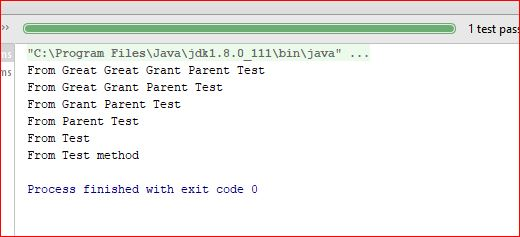

# Junit Tips

# @BeforeClass Bhavior 
1. If all test parents & child has same name method, only chid method will be active 
2. if all method names are different but all are @BeforeClass , it will be parent => child 

