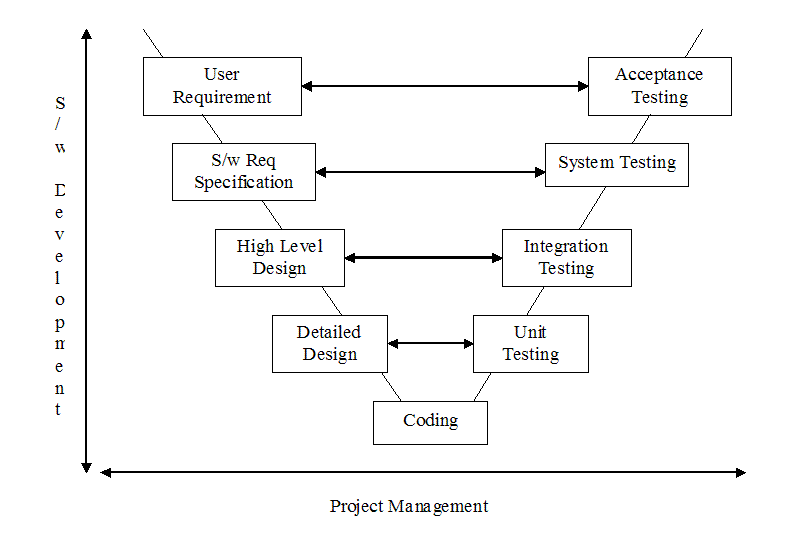

# MediaLibrary
Media Library : A small project to practice unit testing in different layers. 

# Target 
- Complete a project end to end with unit tests 
- Following V diagram of testing

# BOOK
 https://www.amazon.com/Test-Driven-Development-Microsoft%C2%AE-Developer-Reference/dp/0735619484
 
# Test Model 
- V Diagram of testing 

(https://insights.sei.cmu.edu/sei_blog/2013/11/using-v-models-for-testing.html) 

- Basic Understanding in Bangla : https://www.youtube.com/watch?v=JHDsfX1DR0M

# Test Execution 
- Maven management 
- CI Run

# Run With Maven 
- Running Unit Test: mvn clean test
- Running integration tests: mvn clean verify
- See test results in Allure : mvn site

# To do
- Make it spring boot app webservice
- Spring test
- spring MVC
- Unit test  & performance tests 
- Mobile App to access

